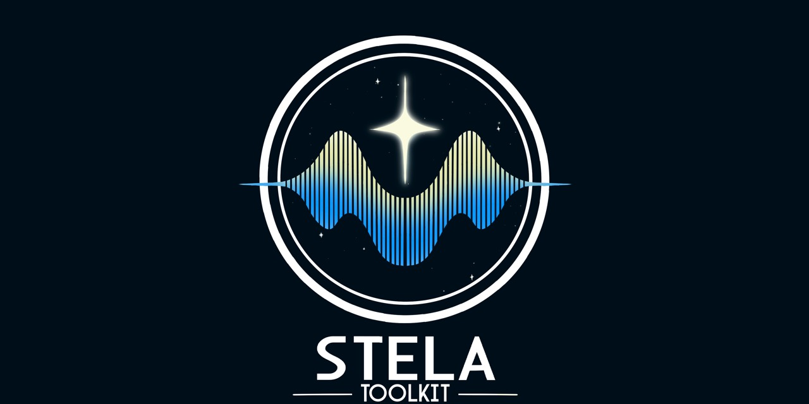

  <em>Logo design by Elizabeth Jarboe</em>

# Welcome to the STELA Toolkit 
The **STELA Toolkit** is a Python package for interpolating astrophysical light curves using Gaussian Processes (more ML models to come!) in order to compute dta products in the frequency domain (power spectra, lag spectra, coherence, etc.) and in the standard time domain, like lags from the cross correlation function. 

STELA is designed for:

- Astronomers dealing with irregular, noisy light curve data
- Users who want to generate Fourier-based data products (lag spectra, coherence spectra, power spectra, cross spectra)
- ... or standard time-domain products, like lags with CCF and linear ICCF.

Get started:

- [Overview](overview.md) — What STELA can do and how it works
- [Tutorial](tutorial.ipynb) — Hands-on with GP modeling, interpolation, and lag analysis
- [Gaussian Processes](gaussian_process_intro.md) — Background, intuition, and implementation
- [Module Reference](reference) — Technical docs and API

If you're new to GP modeling, the overview, tutorial, and intro to GPs are the best places to begin.